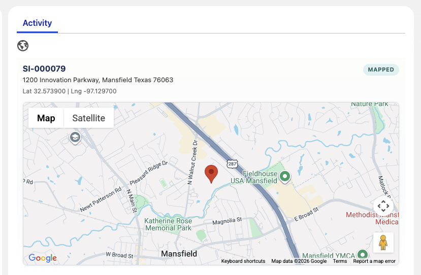
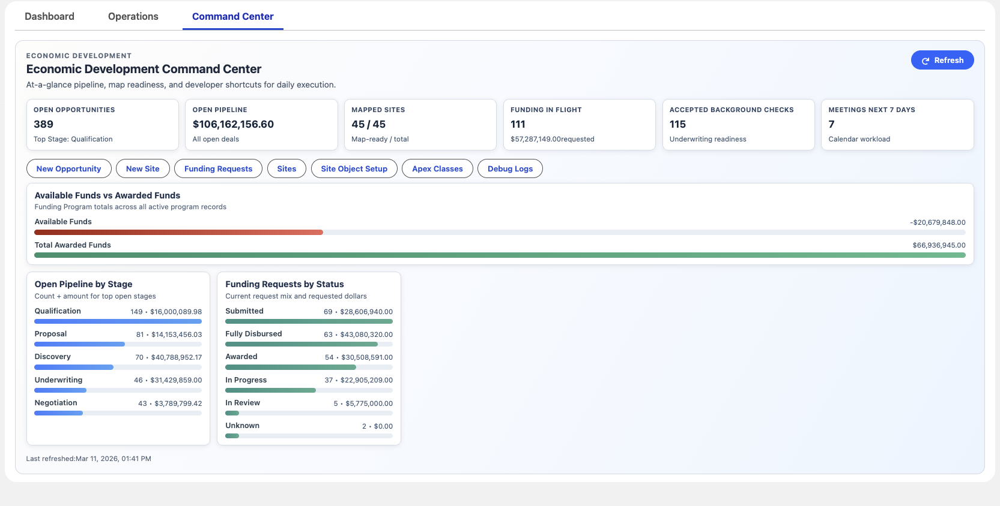

# Economic Development Demo Tools

This repo contains Salesforce demo enhancements focused on visual storytelling for Economic Development use cases. This was Built off of a Trialforced Demo on the Internal Salesforce Toolset. The author of that demo is Andy S. These tools were used to enhance the demo, and modernize in a few areas. 

## Featured Assets

### Site Map Viewer (`siteRecordMap`)
A Lightning Web Component for the `Site__c` record page that:
- displays map pins using best-available coordinates
- falls back through verified, geolocation, and base lat/long fields
- shows address + coordinate context
- includes optional debug output for troubleshooting

Primary files:
- `force-app/main/default/lwc/siteRecordMap/*`
- `force-app/main/default/classes/SiteMapController.cls`

Screenshot:



### Economic Development Command Center (`econDevHomeHeader`)
A home-page dashboard style LWC that provides:
- pipeline and operational KPI cards
- quick action buttons for common admin and developer tasks
- stage and funding status bar charts
- funding program comparison chart (`Available Funds` vs `Total Awarded Funds`)

Primary files:
- `force-app/main/default/lwc/econDevHomeHeader/*`
- `force-app/main/default/classes/EconDevHomeHeaderController.cls`

Screenshot:



Add additional screenshots in `docs/screenshots/` as needed.

## Quick Deploy

Prerequisites:
- Salesforce CLI (`sf`)
- Authenticated org alias (example: `econdev`)

One-click deploy from GitHub:

<a href="https://githubsfdeploy.herokuapp.com?owner=RussEvans222&repo=Economic-Development-Tools&ref=main">
  
</a>

Deploy all featured metadata:

```bash
./scripts/deploy-econdev-assets.sh econdev
```

## Optional Demo Data Loader (Secondary)

This repo also includes a one-time data loader utility (`EconDevDemoCloneService`) used for demo data seeding and idempotent reruns.

Dry run:
```bash
./scripts/run-econdev-loader.sh econdev --dry-run
```

Execute:
```bash
./scripts/run-econdev-loader.sh econdev
```

Support files:
- `scripts/apex/econdev_demo_clone_dry_run.apex`
- `scripts/apex/econdev_demo_clone_run.apex`
- `scripts/soql/econdev_demo_validation.soql`
- `scripts/apex/econdev_demo_cleanup.apex`
